# Kart plugin user documentation

Below you can find some of the main functionalities of the plugin explained.

## Setup

To start using the plugin, you first have to install Kart. Download it from [here]() and install it in your system.

To configure the plugin, use the `Kart/Kart settings` menu to open the setting dialog.

In the `Kart executable folder` field, enter the path to your Kart executable.

If the Kart folder is not configured, the Kart plugin will use the default install locations, as follows:

- **Windows**: %PROGRAMFILES%\Kart
- **OSX**: Applications/Kart.app/Contents/MacOS
- **Linux**: /opt/kart

Open the Kart explorer using the `Kart/Kart explorer` menu.

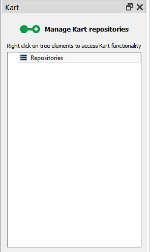

If the installed version is not correct, you will see a message like this:

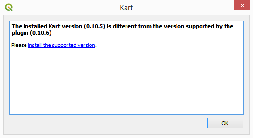

Currently, the minimum required Kart versions is v0.10.6.

## Creating a repository

The first thing you have to do to start working with Kart is to create a repository. A repository will store all your layers and all the history of changes that you made in them.

Right-click on the `Repositories` element in the Kart explorer tree and select `Create new repository`.

In the folder selection dialog that will appear, select the folder where you want to create your repository and the backend to use for the repository working copy.

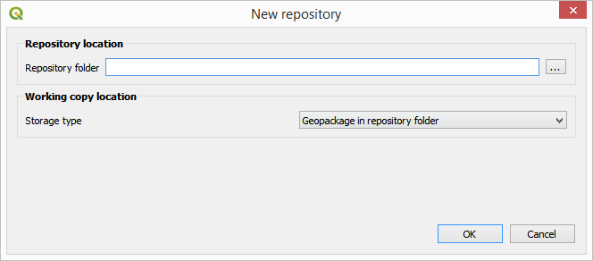

In case you select the PostGIS backend, you will have to enter some additional information to define the PostGIS connection.

Click on `OK`. The new repository will be added to the explorer tree.

## Cloning a repository

If you want to clone a existing repository, Right-click on the `Repositories` element in the Kart explorer tree and select `Clone repository`.

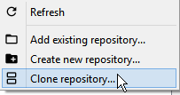

In the dialog that will appear, select the location of the repository to clone (it can be a local folder or a remote URL) and the folder where you want to store the clone. You can also configure the backend and apply a spatial filter in case you do not want to clone all the content of the repository.

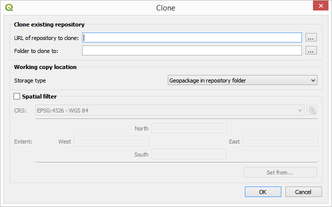

Click on `OK`. The cloned repository will be added to the list of available repositories in the main repositories panel.

## Adding/recovering data to/from a repo

To add a layer that you want to version to a repository, right-click on the repository element in the explorer tree and select `Import layer in to repo`.

In the dialog that will show up, select the file with the layer (only vector layers and tables) that you want to import. It will be imported into the repo and it will be shown under the `Datasets` element of the repository in the explorer tree.

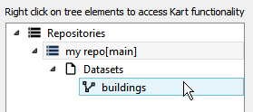

If you want to make changes to this dataset and start storing its history, you can now add it to the current QGIS project. Right-click on the dataset element in the explorer tree and select `Add to QGIS project`. The dataset will be added to the project and you can start working with it.

Alternatively, you can just drag and drop the dataset element into the QGIS canvas.

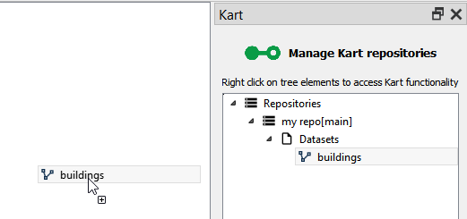

## Making changes to a dataset.

Work with the dataset that you have just added like you would do with any other one in QGIS. When you edit it and save your changes, they will be stored in the corresponding working copy of the repository, and they can now be added to the dataset history.

To visualize the changes that you have made to a dataset since the last time that you commited to the repository (or since the time when you imported it, in case you haven't made any changes yet), right-click on the repository and select `Show working copy changes`. You will see something like this:

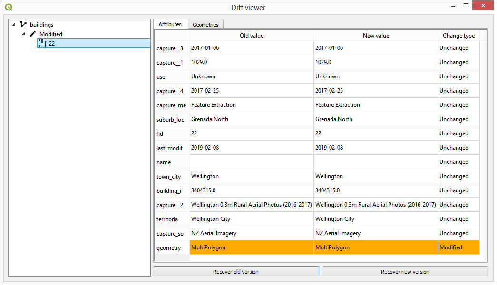

The dialog show all changes made to the repository, which might have several datasets that have been modified. You can select the individual feature to see the changes that were made to both their attributes and geometry.

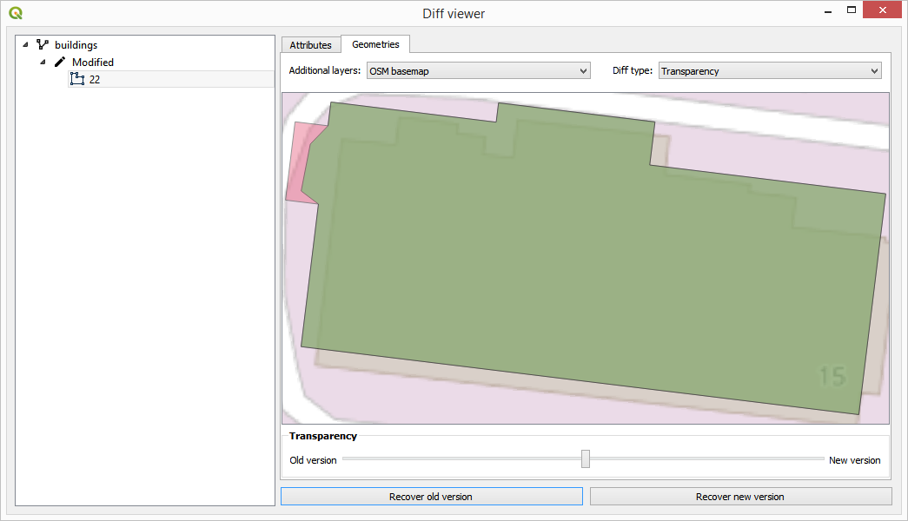

In the geometry tab you can select how you want to render the difference between the old and the new geometry. You can also select the additional layers that you want to show along with the feature geometries, to provide context. The symbology used in the geometry changes viewer can be configured in the Kart settings.

To commit the changes and create a new version in the repository, right-click on the repository element in the explorer tree and select `Commit working copy changes`. You will see the following dialog:

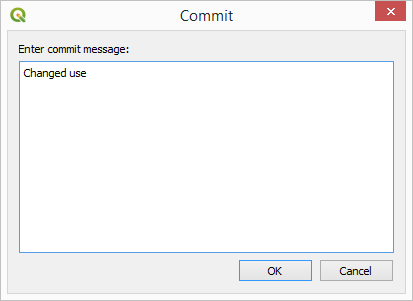

Enter the commit message to identify this set of changes, and click on `OK`

If you want the plugin to automatically commit your changes whenever you finish editing a layer in QGIS, you can enable the `Auto commit` option in the Kart settings dialog.

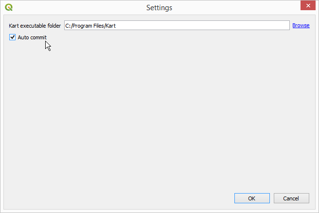

As soon as you close an editing session for a layer, a new commit with an automatic message will be created for those changes, and your working copy will never have pending changes.

## Reseting changes in the working copy

In case you have made changes to a dataset, but you don't want to keep them, you can always reset them and go back to the latest version in the repository. The working copy of your dataset will be modified to have the same content as the latest version that was commited.

To reset the working copy of a given dataset, right-click on the dataset element in the Kart explorer tree and select the `Discard working copy changes for this dataset` menu.

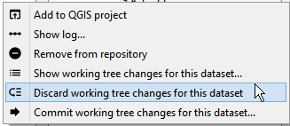

The dataset will be reseted to the latest commit, and it will have no pending changes in the working copy.

You can reset the full working copy (all of its datasets) by right clicking on the repository element and selecting the `Discard working copy changes`menu.

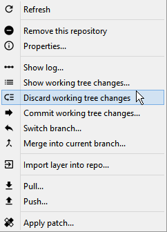

## Exploring the history of a repository

To see the list of changes in the repo (for all the layers that it might contain), right-click on the repository element and select `Show log`. You will see a dialog like the one shown next.

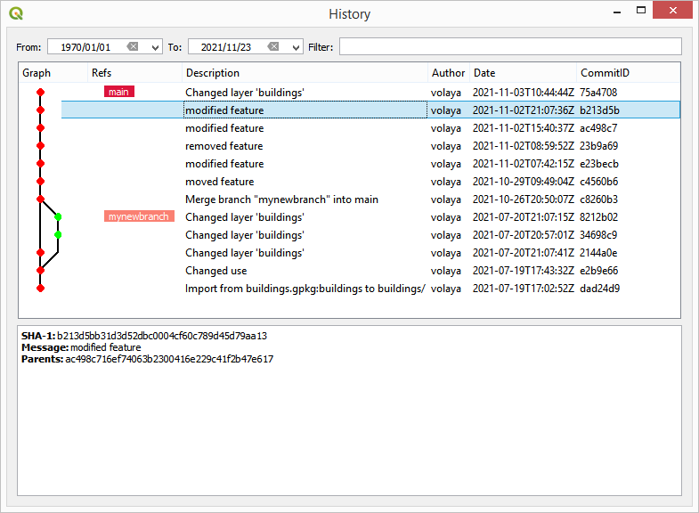

Right-clicking on the different elements representing commits you can access additional functionality. For instance, you can explore the changes introduced in each of them by selecting `Show changes for this commit`. This will open the changes dialog that we already saw in the last section.

You can filter the list of commits shown in the dialog by using the text box on the top and the date selectors.

## Working with branches.

You can create branches in the repository, to keep certains changes isolated. Branches can later be merged, to consolidate all changes together.

To create a branch at a given commit, right-click on it in the history dialog and select `Create branch at this commit`. In the dialog that will appear, enter the name for the new branch.

You will see that a new label appears now in the `Refs` column for that commit, along with the `main`label that already existed before.

To make that branch the active one, right-click on the commit, and you will see that the context menu now has a menu named `Switch to branch '[name of your branch]'`.

The active branch is shown with a red color, while other ones are shown in salmon color.

If you now make changes in the repository datasets and commit them, the new commit will be added to the tip of the new active branch.

To merge any of the repository branches into the current branch, select the repository element in the explorer tree and select `Merge into current branch`. In the dialog that will appear, select the branch to merge.

If the changes in both branches are not compatible (i.e. the same feature has been modified differently in each of them), the merge cannot be performed and you will see the following message:

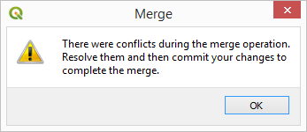

To solve the conflicts, right-click on the repository element in the explorer tree. Since the repository is conflicted, you will see that the context menu has now a different content.

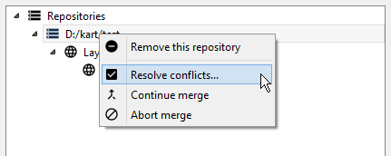

Select the `Solve conflicts` menu and you will see a dialog like the one shown below:

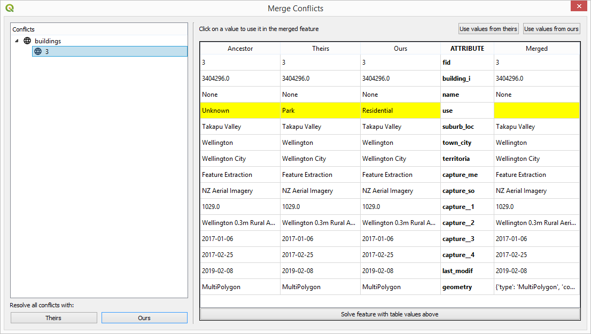

To solve the existing conflicts:

* Use the tree (left) to navigate between all the features that are in conflict.

* The main part of the panel show four version of the feature:

 - The feature, before it was modified by either person (Ancestor).

 - The feature, as modified in the current branch (Ours).

 - The feature, as modified in the branch being merged (Theirs).

 - The feature, final (resolved) version (Merged) (this is what the feature will look like *after* resolving the conflict and ending the merge operation).

* To choose a resolution for the feature:

 - Press `Use values from theirs` to fill the resolved version with the theirs version.

 - Press `Use values from ours` to fill the resolved version with the ours version .

 - Manually click on individual values to use them for the merged feature.

* When the `Merged` column has the values that you desire, click on the `Solve feature with table values above`.

* Continue solving the remaining feature conflicts.

* When all features conflicts have been resolved, the dialog will close and the merge operation will be finished.

Merged branches can be clearly seen in the log dialog

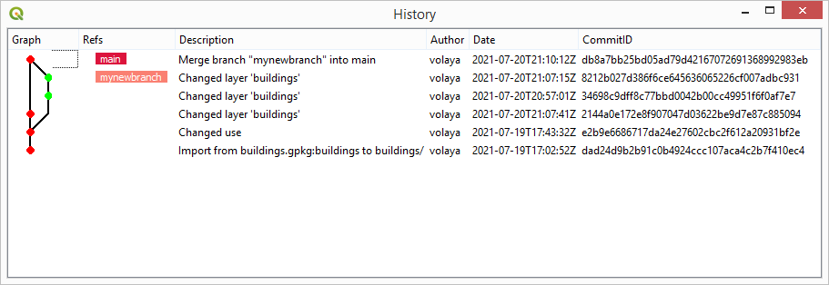

## Context menus in the QGIS layers list

Once a dataset is added is to your QGIS project and you can edit it and work with it, you do not need to open the Kart explorer to perform some of the most common operations. Right-click on the dataset in the QGIS layers list and you will find a `Kart`menu under it, which contains some entries to directly work with Kart for that dataset.

## Working with remotes

You can move changes to/from a copy of your repository by using Kart push/pull operations. That allows to synchronize the history of your copy with the history of any other copy of the repository.

To push your history to a remote copy of the repository, right-click on the repository element in the explorer tree and select the `Push...` menu.

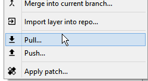

In the dialog that will appear, select the branch to push and the remote to push to.

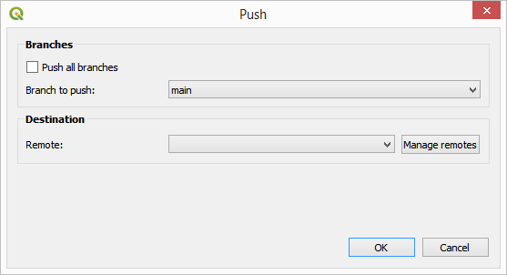

If your repository was cloned from another one, it will already have the url of the parent repository configured, and the `Remote` dropdown list will not be empty. Otherwise, or in case you want to add a remote that is not the already configured parent one, you have to manually enter the information about the remote location, by clicking on the `Manage remote` button and using the dialog that will appear.

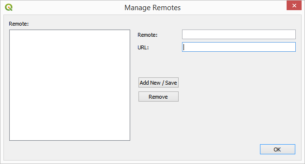

To pull your history from a remote copy of the repository, right-click on the repository element in the explorer tree and select the `Pull...` menu.

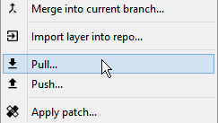

In the dialog that will appear, select the remote to pull from and the branch from it that you want to use. Then click on `OK`.

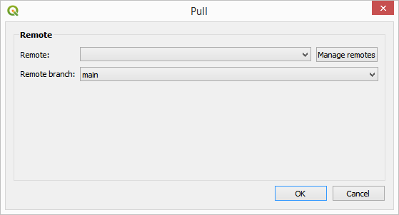

If the changes in the remote repo are not compatible with changes that might exist in your repo, the pull operation will result in conflicts. In that case, you can solve those conflict in the same way as explained for the case of a branch merge.

